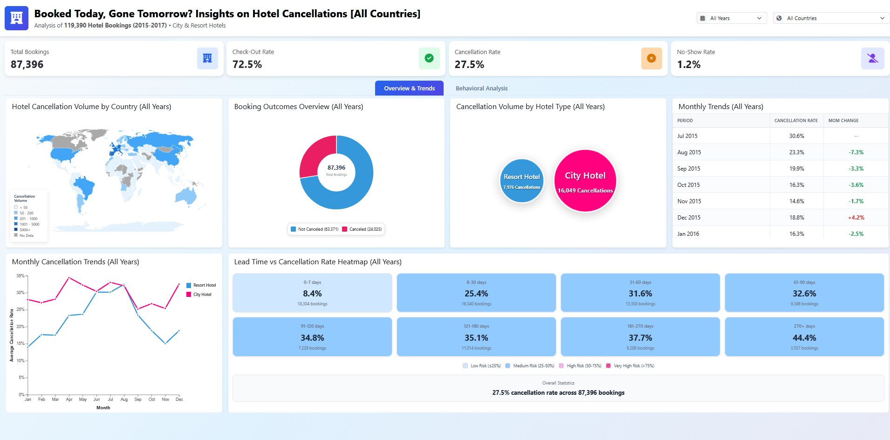
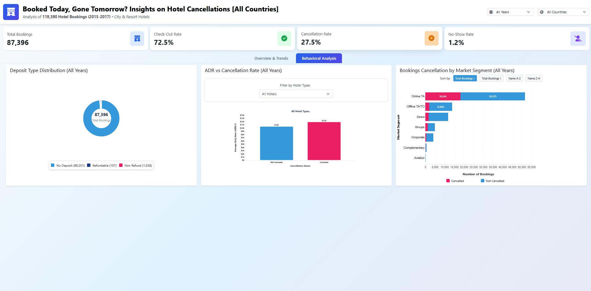

<h1>Booked Today, Gone Tomorrow?</h1>

CDS6324 Data Visualization (Trimester March/April 2025 - Term 2510)

<h2>Overview</h2>
<div align='justify'>
  <p>
    Hotel cancellations represent a significant revenue leak in the hospitality industry. This project presents a high-performance, interactive <strong>D3.js dashboard</strong> that analyzes a dataset of <strong>119,390 bookings</strong> to uncover behavioral patterns. Unlike static reports, this tool allows users to perform multi-dimensional analysis across different timeframes and geographical locations.
  </p>
  <p align='center'>
    
  </p>
  <p align='center'>
    
  </p>
  <p align='center'>
    View <strong>Interactive Dashboard</strong> on
  </p>
  <p align='center'>
    <a href='https://kaijun05.github.io/hotel-cancellations-dashboard/'>
      
    </a>
  </p>
</div>

<h2>Dataset</h2>
<div align='justify'>
  <p>
    The <strong>“Hotel Booking Demand Dataset”</strong> comprises a total of <strong>119,390 records</strong> from bookings made at a <strong>resort hotel (40,060 records)</strong> and a <strong>city hotel (79,330 records)</strong> collected between <strong>July 1st, 2015</strong> and <strong>August 31st, 2017</strong>. It consists of <strong>32</strong> features related to guest bookings. These features cover a wide range of crucial variables including cancellation status, lead time, arrival date details (year, month, week number), length of stay (weekdays and weekends), and type of hotel. The use of this extensive data set allows us to perform a comprehensive analysis of hotel booking behavior, including trends in cancellations, seasonal patterns, and differences between hotel types. Additionally, we can gain insights from our dashboard into how certain factors such as booking lead time, customer type, and stay duration may influence the likelihood of a booking being canceled.
  </p>
  <p>
    The data is sourced from <a href='https://www.kaggle.com/datasets/jessemostipak/hotel-booking-demand'>Kaggle</a>.
  </p>
</div>

<h2>Project Structure</h2>

```
CDS6324-Project/
├── css/ # CSS styles for charts and tables
│ ├── adr_cancellation.css
| ├── booking_outcomes.css
| ├── cancellation_rate_lead_time_heatmap.css
| ├── dashboard.css
| ├── hotel_cancellation_rate.css
| ├── hotel_type_comparison.css
| ├── market_segment.css
| ├── monthly_line.css
| ├── summary_kpi.css
│ └── summarytable.css
├── data/ # CSV datasets
│ ├── Cleaned_Hotel_Booking_Demand_Dataset.csv
│ └── world.geojson
├── js/ # JavaScript files for each visualization
│ ├── adr_cancellation.js
| ├── booking_outcomes.js
| ├── cancellation_rate_lead_time_heatmap.js
| ├── dashboard.js
| ├── hotel_cancellation_rate.js
| ├── hotel_type_comparison.js
| ├── market_segment.js
| ├── monthly_line.js
| ├── summary_kpi.js
│ └── summarytable.js
└── index.html # Dashboard html file
```

<h2>Key Features</h2>
<div align='justify'>
  <ul>
    <li>
      <strong>Global State Controller:</strong> Implemented a centralized <code>DashboardController</code> that manages the state across 10+ D3.js components. This allows for seamless and simultaneous filtering by Year and Country.
    </li>
    <li>
      <strong>Geographic Drill-Down:</strong> An interactive World Map allows users to visualize cancellation volumes globally in which it is supported by a dynamic country-lookup filter.
    </li>
    <li>
      <strong>Behavioral Heatmaps:</strong> Analyzes the correlation between <strong>"Lead Time"</strong> and <strong>"Cancellation Risk"</strong> to identify high-risk booking windows.
    </li>
  </ul>
</div>

<h2>Methodology</h2>
<div align='justify'>
  <ul>
    <li>
      <strong>Frontend:</strong> HTML5, CSS3, Bootstrap 5.
    </li>
    <li>
      <strong>Visualization Engine:</strong> D3.js (v7) utilizing the <strong>Enter-Update-Exit</strong> pattern for smooth transitions and object constancy.
    </li>
    <li>
      <strong>Data Pipeline:</strong> Python (Pandas) was used for initial cleaning, handle missing values, and feature engineering.
    </li>
    <li>
      <strong>Geo-Mapping:</strong> Integrated <code>world.geojson</code> with ISO-3166 alpha-3 mapping logic to provide human-readable names for some of the countries from coded raw data.
    </li>
  </ul>
</div>

<h2>Business Insights & Key Findings</h2>
<div align='justify'>
  <p>
    Based on the multi-dimensional analysis of <strong>119,390</strong> hotel records, the following strategic insights were identified:
  </p>
  <ol>
    <li>
      <strong>Geographic & Institutional Risk Assessment:</strong>
      <ul>
        <li>
          <strong>Regional Hotspots:</strong> The analysis identified Portugal as the region with the highest cancellation volume, where it records <strong>9,791</strong> cancellations out of 27,453 total bookings in which it shows a significant <strong>35.7% cancellation rate</strong>.
        </li>
        <li>
          <strong>Hotel Type Disparity:</strong> City hotels face a much higher risk of cancellation. It records <strong>16,049 cancellations</strong> compared to just <strong>7,976</strong> for resort hotels. This suggests that urban travelers may have more volatile plans or a wider variety of alternative options.
        </li>
      </ul>
    </li>
    <li>
      <strong>Booking Behavior & Lead Time Analysis</strong>
      <ul>
        <li>
          <strong>The Lead Time Correlation:</strong> A clear positive correlation exists between booking advance time and cancellation probability; generally, <strong>longer lead times</strong> are associated with significantly <strong>higher cancellation rates</strong>.
        </li>
        <li>
          <strong>Seasonal Volatility:</strong> Cancellation rates typically rise from <strong>January to August</strong>, experience a brief decline until November, and then <strong>spike sharply</strong> at the end of the year for both hotel types.
        </li>
      </ul>
    </li>
    <li>
      <strong>Segment & Financial Insights</strong>
      <ul>
        <li>
          <strong>Market Segment Vulnerability:</strong> The <strong>Online Travel Agency (Online TA)</strong> segment is the most volatile, contributing the highest volume of cancellations <strong>(18,245)</strong> between 2015 and 2017.
        </li>
        <li>
          <strong>The ADR Paradox:</strong> Interestingly, cancelled bookings tend to have a <strong>higher Average Daily Rate (ADR)</strong> than completed stays. This indicates that customers booking high-value rooms are more likely to cancel, potentially due to budget reconsiderations or shifting luxury travel plans.
        </li>
        <li>
          <strong>Flexibility vs. Commitment:</strong> The vast majority of bookings <strong>(86,251)</strong> were made with <strong>no deposit</strong>, a policy that encourages flexible reservation behavior but directly correlates with the high overall cancellation rates observed.
        </li>
      </ul>
    </li>
  </ol>
</div>

<h2>Strategic Recommendations</h2>
<div align='justify'>
  <p>
    To avoid these risks, the following data-backed strategies are recommended:
  </p>
  <ol>
    <li>
      <strong>Dynamic Overbooking:</strong> Adjust overbooking buffers during the <strong>January–August</strong> peak and for bookings originating from <strong>Online TA</strong> to protect revenue.
    </li>
    <li>
      <strong>Targeted Deposit Policies:</strong> Implement stricter non-refundable deposit requirements for <strong>high-ADR bookings</strong> and <strong>long-lead-time</strong> reservations to reduce "budget reconsiderations".
    </li>
    <li>
      <strong>Regional Retention Campaigns:</strong> Develop localized re-engagement or loyalty incentives specifically for the <strong>Portuguese market</strong> to reduce its 35.7% cancellation baseline.
    </li>
  </ol>
</div>
  
<h2>Installation & Requirements</h2>
<div align='justify'>
  <p>
    Before running the project locally, make sure you have installed the following:
  </p>
  <ul>
    <li>
      <strong>A Modern Web Browser (e.g., Google Chrome, Mozilla Firefox)</strong>
    </li>
    <li>
      <strong>Python 3.13+</strong> or <strong>VS Code "Live Server" Extension</strong>
    </li>
  </ul>
</div>

1. In your terminal, clone the repository by typing:
```bash
git clone https://github.com/kaijun05/hotel-cancellations-dashboard
cd hotel-cancellations-dashboard
```
2. Start a local server (D3.js requires a server to load data files):
```bash
python -m http.server 8000
```
3. Open your browser and visit:
```bash
http://localhost:8000/index.html
```

<h2>Contributors</h2>

|   | Name                              |
|--:|:-----------------------------------------:|
| 1 | Looi Kai Jun |
| 2 | Nur Afreen Junaidah binti Noorul Ameen |
| 3 | Nik Syareena Aida binti Nik Ahmad Faizul |
| 4 | Chin Jia Wen |
